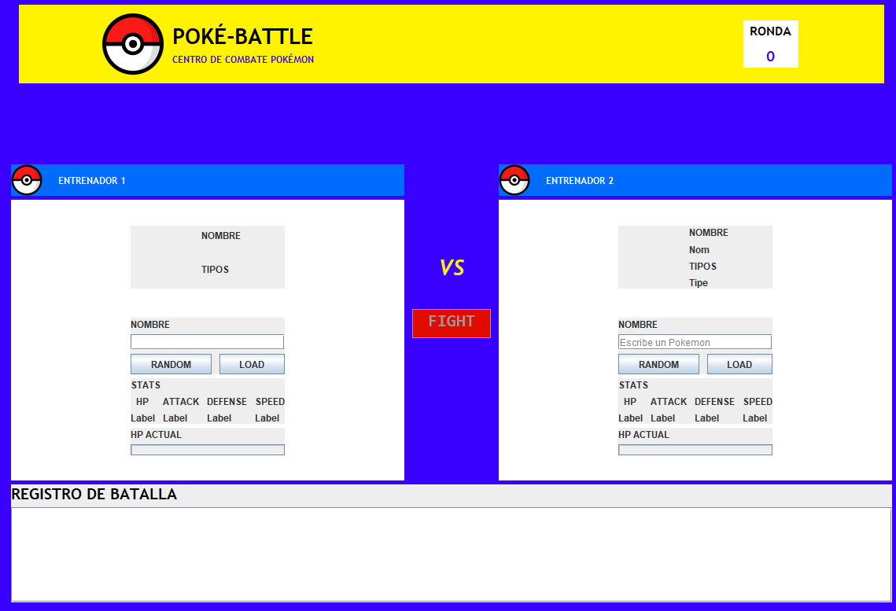
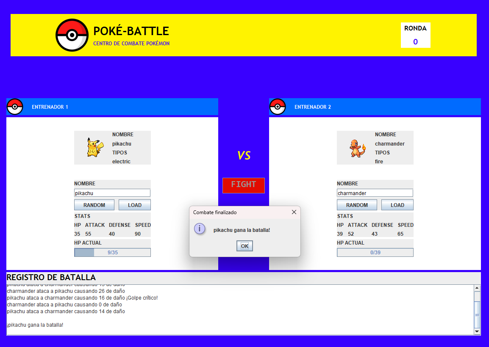
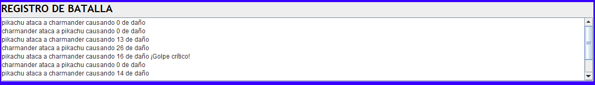

<div align="center">

# Poke-Battle
<br/>


<br/>

**mini-aplicación de escritorio en Java Swing que simula un combate estilo Pokémon Stadium entre dos Pokémon obtenidos en vivo desde PokeAPI [PokeAPI](https://pokeapi.co/).**

</div>

---

## Descripción

**Poke-Battle** es un proyecto académico que consulta datos de Pokémon directamente desde la API pública **PokeAPI** y los usa para simular un combate por turnos entre dos Pokémon, con una interfaz gráfica de escritorio construida con **Java Swing**.

Los datos (nombre, estadísticas, habilidades y sprite) no están guardados en el proyecto: se solicitan en tiempo real a la API cada vez que se busca un Pokémon.

## Funcionalidades

- Búsqueda de Pokémon por nombre.
- Visualización de ID, peso, altura, habilidades y estadísticas base (HP, ataque, defensa, ataque especial, defensa especial y velocidad).
- Carga del sprite oficial del Pokémon desde la API.
- Simulación de combate entre dos Pokémon.
- Manejo de errores cuando el Pokémon no existe o no hay conexión.

## Herramientas y tecnologías

<div align="center">

<a href="https://www.jetbrains.com/idea/"></a>
<a href="https://www.java.com/"></a>
<a href="https://docs.oracle.com/javase/tutorial/uiswing/"></a>
<a href="https://pokeapi.co/"></a>

</div>

<div align="center">

| Herramienta       | Uso en el proyecto                                                             |
|-------------------|--------------------------------------------------------------------------------|
| **IntelliJ IDEA** | IDE para el desarrollo de la aplicación y diseño de formularios (GUI Designer) |
| **Java**          | Lenguaje de programación principal                                             |
| **Swing**         | Construcción de la interfaz gráfica de escritorio                              |
| **PokeAPI**       | API REST pública de la que se obtienen los datos de los Pokémon                |
| **org.json**      | Lectura y procesamiento de las respuestas JSON                                 |
| **java.net.http** | Cliente HTTP nativo de Java para consumir la API                               |

</div>

## Uso de PokeAPI

El proyecto consume la API REST pública [PokeAPI](https://pokeapi.co/) (no requiere clave de acceso).

| Endpoint | Datos que se usan |
|---|---|
| `GET https://pokeapi.co/api/v2/pokemon/{nombre}` | id, nombre, peso, altura, habilidades, estadísticas y sprites |

Si el nombre no existe, la API responde con código `404` y la aplicación muestra un mensaje de error.

## Estructura del proyecto

```
Poke-Battle/
├── README.md
├── screenshots
└── src/
    ├── api/                        
    │   ├── LoadPokemon.java        # Carga un Pokémon
    │   ├── PokeApiClient.java      # Consumo de PokeAPI
    │   └── PokeApiParser.java      # Lectura del JSON, lo convierte y setea atributos del Pokemon
    ├── battle/
    │   ├── Battle.java             # Logica de batalla 
    │   └── BattleListener.java     # Interfaz para los eventos del combate en la GUI
    ├── exceptions/
    │   └── PokemonException.java   # Control de excepciones para errores del juego
    ├── libs/
    │   └── json-20230227.jar       # Libreria  
    ├── model/
    │   └── Pokemon.java            # Datos del Pokémon
    ├── ui/
    │   ├── resources
    │   └── PokeStadiums
    │       ├── PokeStadiums.java   # Lógica de la interfaz
    │       └── PokeStadiums.form   # Diseño del formulario (IntelliJ GUI Designer)
    └── Main.java                   # Punto de entrada
        
```

## Cómo ejecutar

1. Clona el repositorio:
   ```bash
   git clone https://github.com/SantiagoLopezUV/Poke-Battle.git
   ```
2. Ábrelo con **IntelliJ IDEA**.
3. Verifica que la librería `org.json` esté agregada (*File → Project Structure → Libraries*). Si no aparece, agrega `src/libs/json-20230227.jar`
4. Ejecuta la clase `Main`.
5. Presiona el botón **RANDOM** o escribe el nombre de un Pokémon (por ejemplo, `pikachu`) y presiona **LOAD**.
6. Presiona el botón **FIGHT** para iniciar el combate.

> **Requisitos:** JDK 22 o superior y conexión a internet.

## Capturas





## Equipo de desarrollo

<div align="center">

<table>
  <tr>
    <td align="center">
      <a href="https://github.com/SantiagoLopezUV">
        <br/>
        <sub><b>Santiago Lopez</b></sub>
      </a>
    </td>
    <td align="center">
      <a href="https://github.com/ospina27">
        <br/>
        <sub><b>Alejandro Ospina</b></sub>
      </a>
    </td>
  </tr>
</table>

</div>


## Créditos y aviso legal

- Datos y sprites proporcionados por [PokeAPI](https://pokeapi.co/) y su repositorio de [sprites](https://github.com/PokeAPI/sprites).
- Pokémon y los nombres de sus personajes son marcas registradas de Nintendo, Creatures Inc. y GAME FREAK Inc. Este proyecto es **educativo, sin fines de lucro** y no está afiliado a ninguna de estas compañías.
